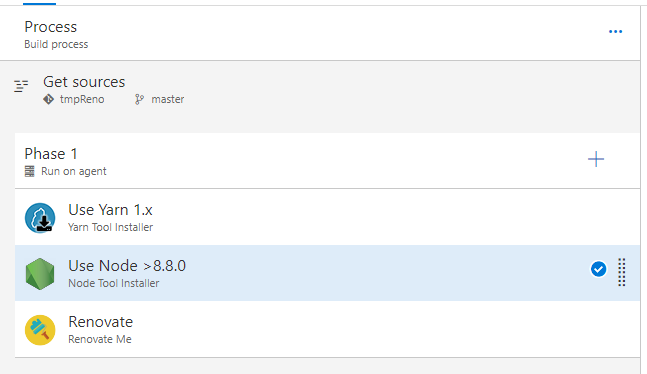
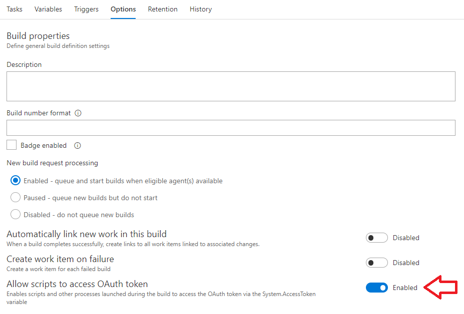

# Renovate Me

> Hey you, yes you, you are at the right place :)  
You want to keep track of your dependencies?

This build task is helping you to use [renovate](https://github.com/singapore/renovate) directly with your VSTS repo.

## Task Setup

- Select a linux Agent queue
- Activate the option: **Allow scripts to access OAuth token** in **Options** Tab
- Make sure you are on a node > 8.3.x
- _Optional_: install yarn

## Basic build definition

### tasks

### options

